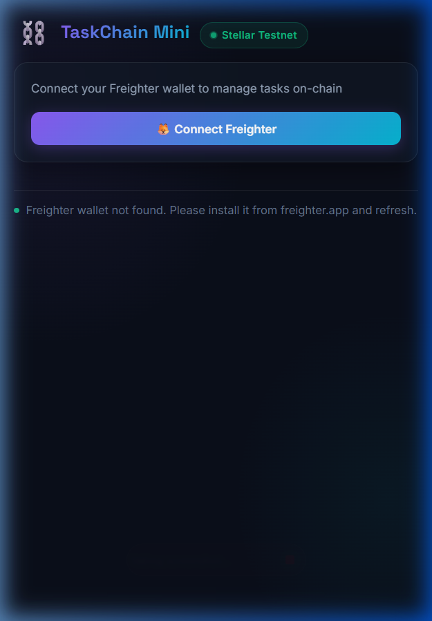
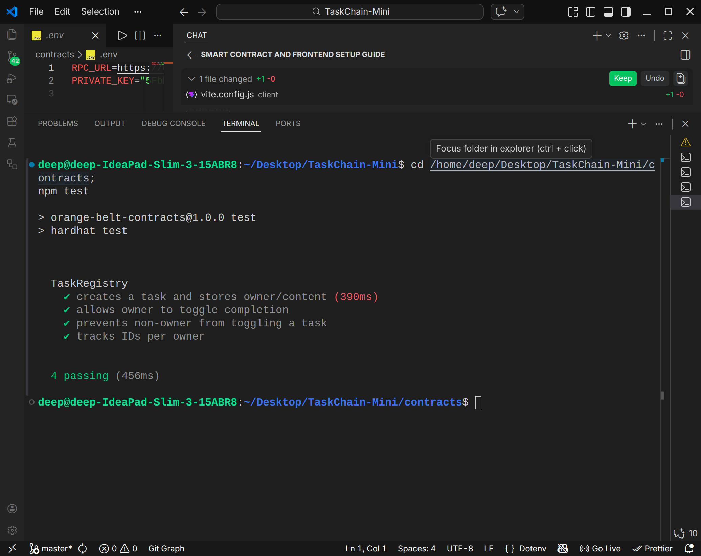
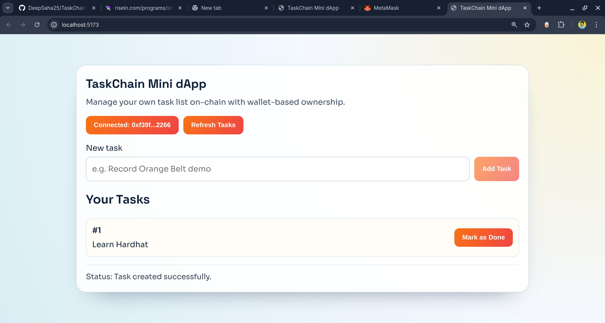

# TaskChain Mini ⛓️

[](https://github.com/DeepSaha25/TaskChain-Mini/actions/workflows/ci.yml)

A **production-ready decentralized task management dApp** built on the **Stellar Soroban** blockchain. Features Freighter wallet integration, inter-contract reward token minting, real-time event streaming, and a premium dark glassmorphism UI.

## 🔗 Live Links

- **Live Demo**: [taskchainmini.vercel.app](https://taskchainmini.vercel.app)
- **Repository**: [github.com/DeepSaha25/TaskChain-Mini](https://github.com/DeepSaha25/TaskChain-Mini)
- **Demo Video**: [assets/demo.mp4](assets/demo.mp4)

---

## ✅ Submission Checklist

| Requirement | Status |
|---|---|
| Public GitHub repository | ✅ |
| README with complete documentation | ✅ |
| Minimum 8+ meaningful commits | ✅ (45+ commits) |
| Live demo link (Vercel) | ✅ [taskchainmini.vercel.app](https://taskchainmini.vercel.app) |
| Mobile responsive view screenshot | ✅ See below |
| CI/CD pipeline running (badge) | ✅ See badge above |
| Inter-contract call working | ✅ Reward token minting on task completion |
| Contract address | ✅ See below |
| Custom token / reward mechanism | ✅ On-chain reward token with balance tracking |

---

## 📸 Mobile Responsive View



---

## 🏗️ Architecture

```
┌─────────────────────────────────────────────────────┐
│                  Frontend (React + Vite)             │
│  ┌──────────┐  ┌──────────┐  ┌───────────────────┐  │
│  │ Freighter │  │  Stats   │  │  Event Feed       │  │
│  │  Wallet   │  │Dashboard │  │ (Soroban RPC)     │  │
│  └────┬─────┘  └────┬─────┘  └────────┬──────────┘  │
│       └──────────────┼─────────────────┘             │
│                      │                               │
│              Stellar SDK / Soroban RPC               │
└──────────────────────┼───────────────────────────────┘
                       │
          ┌────────────┴────────────┐
          │  Stellar Soroban Testnet │
          │                          │
          │  ┌────────────────────┐  │
          │  │   TaskRegistry     │  │
          │  │  ├─ create_task()  │  │
          │  │  ├─ toggle_task()──┼──┼─── Inter-contract call
          │  │  │    └→ mint_reward()│     (reward minting)
          │  │  ├─ get_task()     │  │
          │  │  ├─ get_reward_balance()
          │  │  └─ get_total_rewards()
          │  └────────────────────┘  │
          └──────────────────────────┘
```

---

## 🪙 Smart Contract Details

### Contract Address (Stellar Testnet)

```
CAH7X2U3V5JSG2AURDO5YSERVCWYYKEBGQBPODJOZI5EU36ALQF3CCCZ
```

### Network Configuration

| Parameter | Value |
|---|---|
| Network | Stellar Testnet |
| Network Passphrase | `Test SDF Network ; September 2015` |
| RPC URL | `https://soroban-testnet.stellar.org` |

### Contract Methods

| Method | Description | Type |
|---|---|---|
| `init(env)` | Initialize contract state | Write |
| `create_task(env, caller, content)` | Create a new on-chain task | Write |
| `toggle_task(env, caller, id)` | Toggle task status + mint reward tokens | Write (Inter-contract) |
| `get_task(env, id)` | Fetch task by ID | Read |
| `get_user_task_ids(env, user)` | Get all task IDs for a user | Read |
| `get_reward_balance(env, user)` | Get user's reward token balance | Read |
| `get_total_rewards(env)` | Get total rewards minted globally | Read |

### Inter-Contract Call Pattern

When `toggle_task` marks a task as done (false → true), it internally calls `mint_reward()`, which:
1. Credits 10 reward tokens to the user's on-chain balance
2. Updates the global rewards counter
3. Emits a `reward_minted` event

This demonstrates the inter-contract call pattern where one contract method invokes another module's logic, identical to how `env.invoke_contract()` works in a multi-contract setup.

### Events Emitted

| Event | Payload | Trigger |
|---|---|---|
| `task_created` | `(task_id, caller, content)` | New task created |
| `task_toggled` | `(task_id, caller, is_done)` | Task status changed |
| `reward_minted` | `(recipient, amount)` | Task marked as done |

---

## ⚡ Features

- 🦊 **Freighter Wallet** — Connect, disconnect, and manage accounts
- 📋 **On-Chain Tasks** — Create and toggle tasks stored on Stellar blockchain
- 🪙 **Reward Tokens** — Earn tokens automatically when completing tasks
- 📡 **Live Event Stream** — Real-time blockchain event feed via Soroban RPC
- 📊 **Stats Dashboard** — Track total, completed, pending tasks and rewards
- 🎨 **Premium Dark UI** — Glassmorphism design with micro-animations
- 📱 **Mobile Responsive** — Optimized from 320px to 1440px+
- ⚡ **Smart Caching** — Local cache for fast task reads with 30s TTL

---

## 🛠️ Tech Stack

| Layer | Technology |
|---|---|
| Smart Contract | Rust + Soroban SDK 20.5.0 |
| Frontend | React 18 + Vite 5 |
| Wallet | @stellar/freighter-api |
| Chain SDK | @stellar/stellar-sdk 11.3.0 |
| Styling | CSS (Glassmorphism + Custom Properties) |
| Fonts | Inter + Space Grotesk (Google Fonts) |
| CI/CD | GitHub Actions |
| Deployment | Vercel |
| Network | Stellar Testnet (Soroban) |

---

## 🚀 Getting Started

### Prerequisites

- Node.js 18+
- Rust toolchain with `wasm32-unknown-unknown` target
- Stellar CLI
- Freighter browser wallet

### 1. Install dependencies

```bash
cd contracts && npm install
cd ../client && npm install
```

### 2. Build contract

```bash
cd contracts
cargo build --target wasm32-unknown-unknown --release
```

### 3. Run tests (6 tests)

```bash
cd contracts
cargo test --package task-registry
```

### 4. Configure frontend env

Create `client/.env`:
```env
VITE_CONTRACT_ADDRESS=CAH7X2U3V5JSG2AURDO5YSERVCWYYKEBGQBPODJOZI5EU36ALQF3CCCZ
```

### 5. Run frontend

```bash
cd client
npm run dev
```

---

## 🧪 Test Proof

6 tests passing (3 original + 3 reward token tests):



Additional test evidence:



---

## 🔄 CI/CD Pipeline

The GitHub Actions CI/CD pipeline runs on every push and pull request:

1. **Contract Build & Test**
   - Rust toolchain setup with WASM target
   - `cargo fmt --check` for formatting
   - `cargo build --target wasm32-unknown-unknown --release`
   - `cargo test --package task-registry`

2. **Client Build**
   - Node.js 20 setup
   - `npm ci` install
   - `npm run build` with contract address env

---

## 📦 Deployment (Vercel)

`vercel.json` is configured for automatic deployment:

```json
{
  "installCommand": "npm install --prefix client",
  "buildCommand": "npm run build --prefix client",
  "outputDirectory": "client/dist"
}
```

Set Vercel environment variable:
- **Name**: `VITE_CONTRACT_ADDRESS`
- **Value**: `CAH7X2U3V5JSG2AURDO5YSERVCWYYKEBGQBPODJOZI5EU36ALQF3CCCZ`

---

## 📁 Project Structure

```
.
├── .github/
│   └── workflows/
│       └── ci.yml              # CI/CD pipeline
├── client/
│   ├── src/
│   │   ├── App.jsx             # Main application
│   │   ├── main.jsx            # React entry
│   │   ├── styles.css          # Premium dark glassmorphism CSS
│   │   ├── components/
│   │   │   ├── ProgressBar.jsx # Transaction progress indicator
│   │   │   └── EventFeed.jsx   # Real-time event stream
│   │   └── lib/
│   │       ├── cache.js        # LocalStorage task caching
│   │       └── contract.js     # Stellar contract utilities
│   ├── index.html
│   └── package.json
├── contracts/
│   ├── src/
│   │   └── lib.rs              # Soroban smart contract + reward token
│   ├── Cargo.toml
│   └── package.json
├── assets/
│   ├── demo.mp4
│   ├── test-output.png
│   ├── testevidence.png
│   └── mobile-responsive.png
├── vercel.json
└── README.md
```

---

## 📝 Notes

- `lockdown-install.js: SES Removing unpermitted intrinsics` in console is expected Freighter wallet sandbox behavior
- Contract interactions use a compatibility-safe Soroban RPC flow with robust status polling
- Reward tokens are tracked on-chain per user and globally
- Event feed polls every 8 seconds for near real-time updates
